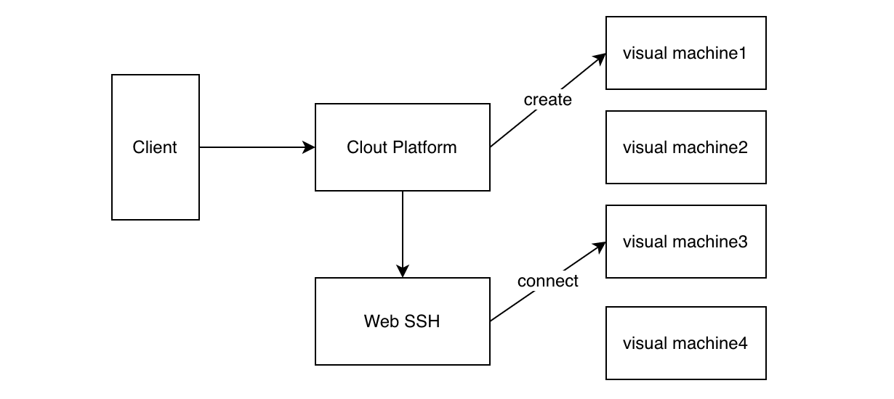

# AchoBeta Cloud Platform

`ABCP`全称`AchoBeta Cloud Platform`, 是`AchoBeta`开发的云平台，旨在简化`Linux`环境的搭建过程。
通常搭建`Linux`有两种方法：搭建虚拟机和购买服务器。对编程新手而言，虚拟机设置复杂且受限于主机性能；而购买服务器虽快速但常常资源浪费，对新手来说性价比不高。`ABCP`通过在现有服务器上创建虚拟云平台，允许团队成员随时创建一台“真实”的服务器，用于学习和工作，从而更高效地利用资源。

## 项目架构


## 快速开始
### 前置条件
- go 1.22+
- python 3+

### 启动
1. 安装 docker：`./sop.py --docker install`
2. 启动环境：`./sop.py --all start`，[点击查看更多环境部署](./docs/setup.md)

## 目录结构
```text
AchoBeta-CloudPlatform 
.
├── cmd main程序所在位置
├── docs 文本文件
├── global 全局控制, 如 DB
├── internal 主要逻辑文件
│   ├── base 实体
│   │   ├── cloud
│   │   ├── config
│   │   └── constant
│   ├── exec 启动逻辑
│   ├── handle
│   ├── middleware 中间件
│   ├── pkg 公共模块
│   │   ├── common
│   │   ├── redis
│   │   ├── request
│   │   └── secret
│   ├── router 路由, api 接口层
│   │   └── api
│   └── service 逻辑实现
├── log 日志
├── script 脚本
│   ├── database
│   └── webssh
└── test 测试
    ├── command
    └── router
```


## 目前待完成的工作

- [x] token 生成策略
- [x] token 校验逻辑设计
- [x] WebSSH
- [ ] Redis 链接、配置、封装等
- [ ] 登陆模块 包括用户的CRUD接口
- [ ] dockerfile 生成、上传、自定义
- [ ] docker 自动化脚本
- [ ] 容器模块 包括创建容器、分配容器、销毁容器、提供容器信息等
- [ ] 登陆链接WebSSH
- [ ] 容器分发的脚本实现
- [ ] k8s 模块
- [x] 文件上传模块